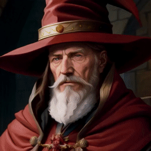

## Wizard Battle

In Wizard Battle, you are a wizard and you cast spells. What spells can you cast? Anything. Throw a fireball, transform into a moose, teleport your opponent to the bottom of the ocean. Anything you can think of, just type it in.

A tiny game, meant to test the concept of competitive real-time creative writing using a large language model.

## TODOs
- TODO: Multiplayer
- TODO: Multiple rounds per battle
- TODO: Live image generation along with text narration

